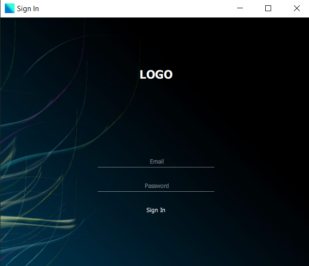

# ✔ Desktop Sign-in Application
 - ### A Desktop GUI Application that features a sign in system and connected to database. 
 - ### Frontend Part is written in Qml and backend part in Python. 
 - ### Also connected the Desktop Application to SQlite database. 

****

	

