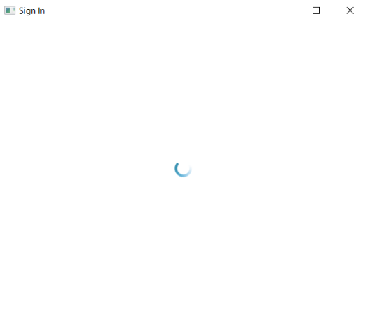

# ✔ Desktop Sign-in Application
 - ### A Desktop GUI Application that features a sign in system and connected to database. 
 - ### Sign-in page view is in Qml and implemented in Python. 
 - ### Also connected the Desktop Application to SQlite database. 

****

	
	
	

